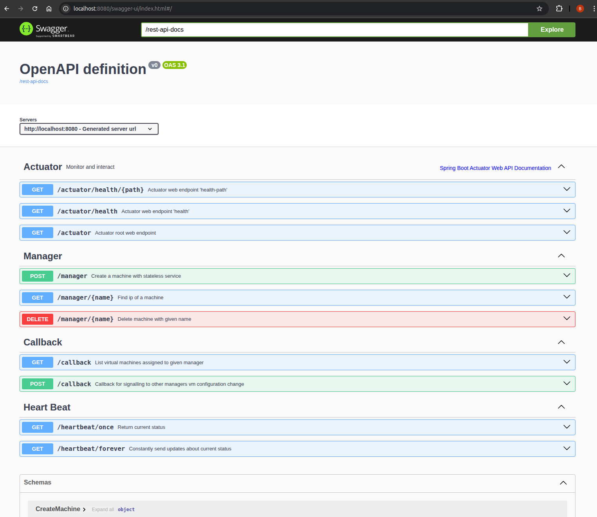
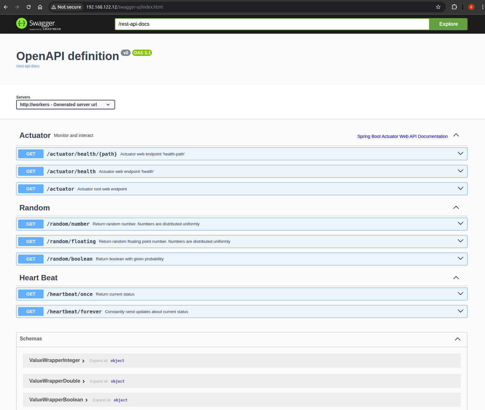
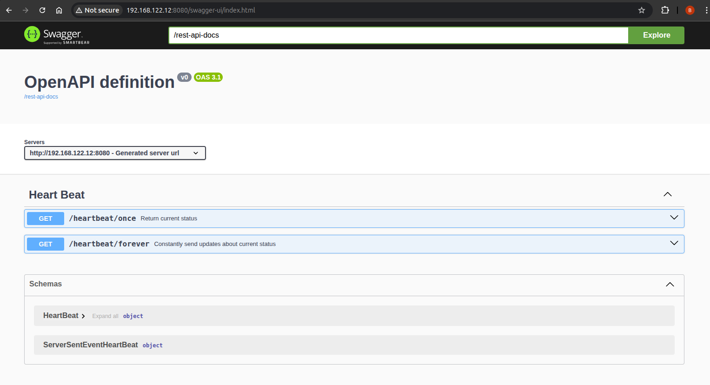
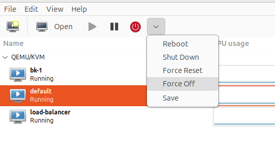
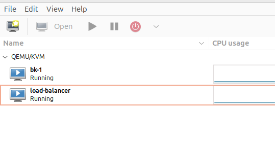
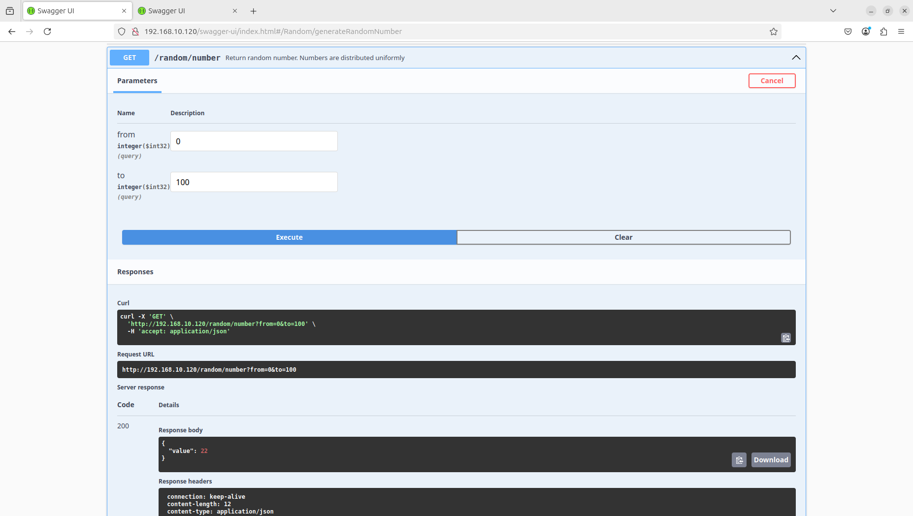
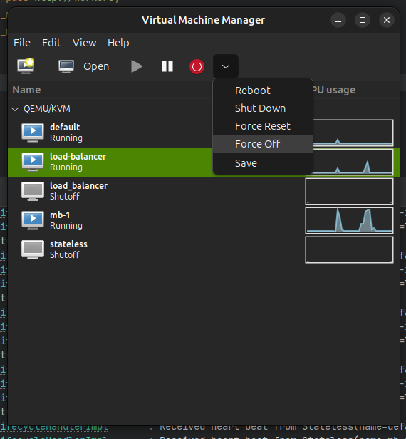

# Konfiguracja

## KVM

Poniższe kroki prowadzą przez proces instalacji i podstawowej konfiguracji KVM (Kernel-based Virtual Machine) wraz z narzędziem `virt-manager` umożliwiającym graficzne zarządzanie maszynami wirtualnymi.

### 1. Sprawdzenie wsparcia sprzętowego dla wirtualizacji

Aby uruchomić KVM, procesor musi obsługiwać technologię wirtualizacji. Można to sprawdzić za pomocą polecenia:

```sh
egrep -c '(vmx|svm)' /proc/cpuinfo
```

Jeśli wynik jest większy niż 0, system wspiera wirtualizację.

### 2. Instalacja wymaganych pakietów

Zainstaluj podstawowe komponenty KVM oraz narzędzia do zarządzania środowiskiem wirtualnym:

```sh
sudo apt update
sudo apt install qemu-kvm libvirt-daemon-system libvirt-clients bridge-utils -y
```

- `qemu-kvm` – podstawowy komponent wirtualizacji
- `libvirt-daemon-system` i `libvirt-clients` – narzędzia do zarządzania maszynami
- `bridge-utils` – umożliwia konfigurację mostów sieciowych

### 3. Weryfikacja wsparcia sprzętowego KVM

Upewnij się, że system obsługuje akcelerację KVM:

```sh
sudo kvm-ok
```

Wynik powinien zawierać informację, że KVM jest dostępny i może być używany.

### 4. Dodanie użytkownika do grup systemowych

Aby móc korzystać z KVM bez uprawnień administratora, dodaj użytkownika do odpowiednich grup:

```sh
sudo adduser "$USER" libvirt
sudo adduser "$USER" kvm
```

Po wykonaniu tej czynności należy się przelogować, aby zmiany zostały uwzględnione.

### 5. Sprawdzenie statusu usługi `libvirtd`

Zweryfikuj, czy usługa `libvirtd` działa poprawnie:

```sh
sudo systemctl status libvirtd
```

### 6. Zarządzanie usługą `libvirtd`

W razie potrzeby możesz włączyć lub wyłączyć usługę `libvirtd`:

```sh
sudo systemctl enable --now libvirtd
sudo systemctl disable --now libvirtd
```

### 7. Instalacja interfejsu graficznego

Zainstaluj `virt-manager` – graficzny interfejs do zarządzania maszynami wirtualnymi:

```sh
sudo apt install virt-manager
```

### 8. Uruchomienie `virt-manager`

Po instalacji program można uruchomić poleceniem:

```sh
virt-manager
```

### 9. Instalacja bibliotek pomocniczych libvirt

```sh
sudo apt-get install libvirt-dev
```

## Konfiguracja Alpine Linux z usługami Java i SSH, oraz uruchomieniem aplikacji z load balancerem

Dokumentacja opisuje proces instalacji i konfiguracji systemu Alpine Linux w środowisku wirtualnym. W ramach konfiguracji uruchamiana jest aplikacja Java jako usługa działająca w tle, z dostępem przez SSH oraz zintegrowanym serwerem Nginx pełniącym rolę load balancera.

---

### 1. Pobranie i instalacja Alpine Linux

Pobierz obraz systemu z oficjalnej strony:
[Alpine Linux](https://alpinelinux.org/downloads/)

Zalecane: obraz w wersji "Virtual".

### Dane dostępowe:

- **Login:** `root`
- **Hasło:** brak (pozostaw puste przy pierwszym logowaniu)

---

### 2. Podstawowa konfiguracja systemu

Po uruchomieniu systemu wykonaj interaktywną konfigurację:

```shell
setup-alpine -q
```

Wybierz układ klawiatury:

```shell
Select keyboard layout: pl
Select variant: pl
```

Następnie zainstaluj system na głównym dysku (`/dev/vda`) z wykorzystaniem trybu systemowego:

```shell
setup-disk -m sys /dev/vda
```

```shell
WARNING: Erase the above disk(s) and continue (y/n) [n]: y
```

Po zakończeniu procesu instalacji, wyłącz maszynę wirtualną:

```shell
poweroff
```

### 3. Konfiguracja po restarcie

Po ponownym uruchomieniu systemu ustaw hasło dla użytkownika `root`:

```shell
passwd root
```

Wprowadź nowe hasło dwukrotnie:

```shell
New password: root
Retype password: root
```

Zainstaluj edytor tekstu:

```shell
apk add nano
```

---

### 4. Konfiguracja repozytoriów pakietów

Edytuj plik zawierający listę źródeł pakietów:

```shell
nano /etc/apk/repositories
```

Zamień:

```shell
#/media/cdrom/apks
http://dl-cdn.alpinelinux.org/alpine/v3.21/main
#http://dl-cdn.alpinelinux.org/alpine/v3.21/community
```

na:

```shell
#/media/cdrom/apks
http://dl-cdn.alpinelinux.org/alpine/v3.21/main
http://dl-cdn.alpinelinux.org/alpine/v3.21/community
```

Zapisz zmiany i zamknij edytor (`Ctrl+S`, `Ctrl+X`).

Zaktualizuj indeks pakietów:

```shell
apk update
```

---

### 5. Instalacja środowiska Java

Zainstaluj OpenJDK w wersji 21:

```shell
apk add openjdk21
```

---

### 6. Konfiguracja serwera SSH

Zainstaluj i skonfiguruj serwer SSH:

```shell
apk add openssh-server
cp /etc/ssh/sshd_config /etc/ssh/ssh_config.backup
```

Wygeneruj klucze hosta:

```shell
ssh-keygen -A
```

**Opis parametru `-A`:** Generuje wszystkie domyślne typy kluczy hosta, jeżeli jeszcze nie istnieją. Klucze zostaną zapisane w domyślnych lokalizacjach bez hasła.

---

#### Modyfikacja konfiguracji SSH

Edytuj plik konfiguracyjny klienta SSH:

```shell
nano /etc/ssh/ssh_config
```

Odkomentuj i zmodyfikuj linijkę:

```shell
#PermitRootLogging prohibit-password
```

na:

```shell
PermitRootLogging yes
```

Sprawdź poprawność konfiguracji:

```shell
sshd -t -f /etc/ssh/sshd_config
```

**Parametry:**

- `-t` – test trybu konfiguracji
- `-f` – wskazanie konkretnego pliku konfiguracyjnego

Uruchom ponownie usługę SSH:

```shell
service sshd restart
```

Dodaj usługę SSH do domyślnego poziomu uruchamiania:

```shell
rc-update add sshd default
rc-service sshd start
```

---

### 7. Połączenie z maszyną zdalnie

Z innej maszyny połącz się z Alpine Linux za pomocą SSH:

```shell
$ ssh root@192.168.122.26
The authenticity of host '192.168.122.26 (192.168.122.26)' can't be established.
ED25519 key fingerprint is SHA256:EMjnkHpSoKWgiz6S6fBAgR4aaKjGxC79sG/oSBUb0oA.
This key is not known by any other names.
Are you sure you want to continue connecting (yes/no/[fingerprint])? yes
Warning: Permanently added '192.168.122.26' (ED25519) to the list of known hosts.
root@192.168.122.26's password:
Welcome to Alpine!

The Alpine Wiki contains a large amount of how-to guides and general
information about administrating Alpine systems.
See <https://wiki.alpinelinux.org/>.

You can setup the system with the command: setup-alpine

You may change this message by editing /etc/motd.

alpine:~#
```

---

### 8. Uruchomienie aplikacji Java

Prześlij aplikację na serwer:

```shell
scp ./stateless/build/libs/stateless.jar root@192.168.122.26:/stateless.jar
```

Przetestuj uruchomienie:

```shell
java -jar /stateless.jar
```

Dostęp testowy:

```
GET http://192.168.122.26:8080/random/boolean?probability=1.0
```

Aby uruchomić aplikację jako proces w tle:

```shell
nohup java -jar /stateless.jar > stateless.log 2>&1 &
```

Sprawdzenie, czy aplikacja działa:

```shell
ps aux | grep stateless.jar
```

---

### 9. Instalacja i konfiguracja serwera Nginx

Zainstaluj serwer WWW:

```shell
apk add nginx
```

Dodaj go do usług uruchamianych przy starcie systemu i uruchom:

```shell
rc-update add nginx default
rc-service nginx start
```

Zweryfikuj status usługi:

```shell
rc-service nginx status
```

Sprawdź działanie:

```shell
curl http://localhost
```

Z zewnątrz maszyny wirtualnej:
```shell
curl http://192.168.122.26
```

---

#### Modyfikacja konfiguracji Nginx

Edytuj plik konfiguracyjny:

```shell
nano /etc/nginx/nginx.conf
```

Po wprowadzeniu zmian, zrestartuj konfigurację:

```shell
rc-service nginx reload
```

---

### 10. Instalacja i konfiguracja QEMU Guest Agent

QEMU Guest Agent pozwala na lepszą integrację maszyny wirtualnej z hypervisorem (np. Proxmox, libvirt), umożliwiając m.in. bezpieczne wyłączanie systemu, synchronizację czasu, uzyskiwanie informacji o systemie i poprawne przesyłanie danych między hostem a VM.

#### Instalacja agenta:

```shell
apk add qemu-guest-agent
```

#### Dodanie do autostartu i uruchomienie usługi:

```shell
rc-update add qemu-guest-agent default
rc-service qemu-guest-agent start
```

#### Weryfikacja działania:

Sprawdź status usługi:

```shell
rc-service qemu-guest-agent status
```


### 11. Install python (required for ansible fact gathering)

```shell
apk add python3
```

### 12. Konfiguracja statycznego adresu IP

Dotychczas działaliśmy na adresie otrzymanym adresie przez DHCP. W ramach klastra będziemy korzystać ze stałego adresu IP. Konfigurujemy plik `/etc/network/interfaces`

Maszyna bezstanowa:

```sh
auto lo
iface lo inet loopback

auto eth0
iface eth0 inet static
    address 192.168.10.200
    netmask 255.255.255.0
    gateway 192.168.10.1
```

Load balancer:

```sh
auto lo
iface lo inet loopback

auto eth0
iface eth0 inet static
    address 192.168.10.201
    netmask 255.255.255.0
    gateway 192.168.10.1
```

Aplikujemy dokonane zmiany:

```sh
/etc/init.d/networking restart
```

## Wirtualny przełącznik

Konfiguracja netplanu dla pierwszego serwera:
```yaml
network:
  version: 2
  ethernets:
    eno2: {}
  bridges:
    br0:
      interfaces: [eno2]
      dhcp4: no
      addresses: [192.168.10.1/24]
```

Konfiguracja netplanu dla drugiego serwera:
```yaml
network:
  version: 2
  ethernets:
    enx000ec6b01bc1: {}
  bridges:
    br0:
      interfaces: [enx000ec6b01bc1]
      dhcp4: no
      addresses: [192.168.10.2/24]
```

Zastosowanie netplanu:
```shell
sudo netplan apply
```

Weryfikacja wirtualnych przełączników:
```shell
brctl show
```

Sprawdzenie, czy wirtualny przełącznik jest podłączony do fizycznego interfejsu:
```shell
bridge link show
```

Jeżeli nie jest musimy go dołączyć:
```shell
sudo ip link set eno2 down
sudo ip link set eno2 master br0
sudo ip link set eno2 up
```

Następnie na nowo należy przydzielić adres do interfejsu:
```shell
sudo ip addr flush dev eno2
```

## Lokalna konfiguracja i uruchomienie menadżera

Aplikacja obsługuje dwa profile środowiskowe:

* `bk` – Bartłomiej Krawczyk,
* `mb` – Mateusz Brzozowski.

### 1. Instalacja środowiska SDK

Użyj polecenia poniżej, aby zainstalować wymagane wersje JDK i narzędzi na podstawie pliku `.sdkmanrc`:

```shell
sdk env install
```

### 2. Budowanie jara

```shell
./gradlew manager:bootJar
```

### 3. Instalacja wymaganych pakietów

```shell
sudo apt install ansible
sudo apt install sshpass
```

### 4. Uruchomienie aplikacji z określonym profilem

Aby uruchomić aplikację z wybranym profilem, użyj jednej z poniższych komend:

#### Profil `bk`:

```shell
SPRING_PROFILES_ACTIVE=bk java -jar ./manager/build/libs/manager.jar
```

#### Profil `mb`:

```shell
SPRING_PROFILES_ACTIVE=mb java -jar ./manager/build/libs/manager.jar
```

# Automatyzacja - skalowalność i wysoka dostępność

## Serwis bezstanowy

1. Weryfikacja czy maszyna się uruchomiła, jeżeli się nie udało powtarzamy.

```shell
$ virsh qemu-agent-command default {"execute":"guest-ping"}
{"return":{}}
```

2. Weryfikacja przydzielonego adresu IP.

```shell
$ virsh domifaddr default --source agent
 Name       MAC address          Protocol     Address
-------------------------------------------------------------------------------
 lo         00:00:00:00:00:00    ipv4         127.0.0.1/8
 -          -                    ipv6         ::1/128
 eth0       52:54:00:40:ec:c3    ipv4         192.168.122.231/24
 -          -                    ipv6         fe80::5054:ff:fe40:ecc3/64
```

3. Ustalenie adresu IP z puli dostępnych adresów danego menadżera.

```yaml
- name: Configure network
  hosts: "{{ current_ip }}"
  become: yes
  vars:
    interface: eth0
    ansible_become: false
    ansible_user: root
    ansible_ssh_pass: root

  tasks:
    - name: Configure static ip
      template:
        src: config/interfaces.j2
        dest: /etc/network/interfaces
      notify: Restart networking

  handlers:
    - name: Restart networking
      command: /etc/init.d/networking restart
      async: 1
      poll: 0
```

```sh
auto lo
iface lo inet loopback

auto eth0
iface eth0 inet static
    address {{ new_ip }}
    netmask 255.255.255.0
    gateway 192.168.122.1
```

```shell
$ ansible-playbook -i 192.168.122.231, ./playbooks/network.yaml -e current_ip=192.168.122.231 -e new_ip=192.168.122.13

PLAY [Configure network] *******************************************************

TASK [Gathering Facts] *********************************************************
ok: [192.168.122.231]

TASK [Configure static ip] *****************************************************
changed: [192.168.122.231]

RUNNING HANDLER [Restart networking] *******************************************
changed: [192.168.122.231]

PLAY RECAP *********************************************************************
192.168.122.231            : ok=3    changed=2    unreachable=0    failed=0    skipped=0    rescued=0    ignored=0
```

4. Weryfikacja czy wirtualna maszyna jest dostępna pod ustalonym adresem IP.

```shell
$ ping -c 1 192.168.122.13
PING 192.168.122.13 (192.168.122.13) 56(84) bytes of data.
64 bytes from 192.168.122.13: icmp_seq=1 ttl=64 time=1021 ms

--- 192.168.122.13 ping statistics ---
1 packets transmitted, 1 received, 0% packet loss, time 0ms
rtt min/avg/max/mdev = 1020.793/1020.793/1020.793/0.000 ms
```

5. Uruchomienie daemona z serwisem bezstanowym na porcie 8080.

```yaml
- name: Configure stateless service
  hosts: "{{ ip }}"
  become: yes
  vars:
    interface: eth0
    ansible_become: false
    ansible_user: root
    ansible_ssh_pass: root

  tasks:
    - name: Start stateless daemon
      ansible.builtin.shell: |
        nohup java -Dserver.forward-headers-strategy=framework -jar /stateless.jar --server.port={{ port }} > stateless.log 2>&1 &
      async: 1
      poll: 0
```

```shell
$ ansible-playbook -i 192.168.122.13, ./playbooks/stateless.yaml -e ip=192.168.122.13 -e port=8080

PLAY [Configure stateless service] *********************************************

TASK [Gathering Facts] *********************************************************
ok: [192.168.122.13]

TASK [Start stateless daemon] **************************************************
changed: [192.168.122.13]

PLAY RECAP *********************************************************************
192.168.122.13             : ok=2    changed=1    unreachable=0    failed=0    skipped=0    rescued=0    ignored=0
```

## Load balancer

Punktu 1-4. tak samo jak w serwisie bezstanowym.

5. Uruchomienie daemon z heart beatem na porcie 8080.

```yaml
- name: Configure heartbeat service
  hosts: "{{ ip }}"
  become: yes
  vars:
    interface: eth0
    ansible_become: false
    ansible_user: root
    ansible_ssh_pass: root

  tasks:
    - name: Start heartbeat daemon
      ansible.builtin.shell: |
        nohup java -Dserver.forward-headers-strategy=framework -jar /heartbeat.jar --server.port={{ port }} > heartbeat.log 2>&1 &
      async: 1
      poll: 0
```


```shell
$ ansible-playbook -i 192.168.122.12, ./playbooks/heart_beat.yaml -e ip=192.168.122.12 -e port=8080

PLAY [Configure heartbeat service] *********************************************

TASK [Gathering Facts] *********************************************************
ok: [192.168.122.12]

TASK [Start heartbeat daemon] **************************************************
changed: [192.168.122.12]

PLAY RECAP *********************************************************************
192.168.122.12             : ok=2    changed=1    unreachable=0    failed=0    skipped=0    rescued=0    ignored=0
```

6. Uruchomienie daemona z load balancerem na porcie 80.

```yaml
- name: Configure load balancer service
  hosts: "{{ ip }}"
  become: yes
  vars:
    interface: eth0
    ansible_become: false
    ansible_user: root
    ansible_ssh_pass: root

  tasks:
    - name: Copy nginx.conf to the server
      copy:
        src: config/nginx.conf
        dest: /etc/nginx/nginx.conf
        backup: yes

    - name: Reload Nginx
      service:
        name: nginx
        state: reloaded
```

```shell
$ ansible-playbook -i 192.168.122.12, ./playbooks/load_balancer.yaml -e ip=192.168.122.12

PLAY [Configure load balancer service] *****************************************

TASK [Gathering Facts] *********************************************************
ok: [192.168.122.12]

TASK [Copy nginx.conf to the server] *******************************************
changed: [192.168.122.12]

TASK [Reload Nginx] ************************************************************
changed: [192.168.122.12]

PLAY RECAP *********************************************************************
192.168.122.12             : ok=3    changed=2    unreachable=0    failed=0    skipped=0    rescued=0    ignored=0
```



Zarządzanie serwerem w ramach menadżera.



Punkty końcowe udostępniane przez serwisy bezstanowe.



Punkty końcowe udostępniane przez load balancer.

# Testowanie ryzyka

## Maszyna z serwisem bezstanowym umiera

Menadżer przez cały czas działa serwisu utrzymuje połączenie heartbeat, serwis co jakiś czas wysyła wiadomość zwrotną o treści: `data: {"status": "OK"}` sygnalizującą poprawne działanie serwisu. Jeśli menadżer nie wykryje przez określony czas połączenia, kilkukrotnie próbuje nawiązanie połączenia, jeśli się to nie uda to usuwamy taką maszynę i menadżer stawia nową maszynę w jej miejsce.

Adres IP nowej maszyny pozostaje taki sam jak adres usuniętej maszyny.
W przypadku błędnej odpowiedzi serwisu, load balancer (nginx) automatycznie przekierowuje żądanie do innej dostępnej maszyny, zgodnie z konfiguracją opcji proxy_next_upstream.



Wymuszamy śmierć maszyny bezstanowej



Domyślna maszyna bezstanowa jest niedostępna.



Pomimo tego, że domyślna maszyna bezstanowa nie działa, zapytania nadal są obsługiwane, przez inne serwisy bezstanowe.


```sh
2025-06-03T18:32:21.016+02:00  INFO 21744 --- [    parallel-11] p.e.p.i.m.i.VmLifecycleHandlerImpl       : Heart beat retry 0 for Stateless(name=default, address=Address(ip=192.168.10.26, port=8080))
2025-06-03T18:32:21.925+02:00  INFO 21744 --- [     parallel-1] p.e.p.i.m.i.VmLifecycleHandlerImpl       : Heart beat retry 1 for Stateless(name=default, address=Address(ip=192.168.10.26, port=8080))
2025-06-03T18:32:23.973+02:00  INFO 21744 --- [     parallel-3] p.e.p.i.m.i.VmLifecycleHandlerImpl       : Heart beat retry 2 for Stateless(name=default, address=Address(ip=192.168.10.26, port=8080))
2025-06-03T18:32:27.315+02:00  INFO 21744 --- [     parallel-5] p.e.p.i.m.i.VmLifecycleHandlerImpl       : Heart beat retry 3 for Stateless(name=default, address=Address(ip=192.168.10.26, port=8080))
2025-06-03T18:32:27.318+02:00 ERROR 21744 --- [or-http-epoll-6] p.e.p.i.m.i.VmLifecycleHandlerImpl       : Retries exhausted or other error occurred

reactor.core.Exceptions$RetryExhaustedException: Retries exhausted: 4/4
```

Po wykryciu braku jednej z maszyny bezstanowej, przez wykonanie czterech heart beatów, uruchamiamy nową instancję.

## Maszyna z load balancerem umiera

Heartbeat w ramach load balancera działa podobnie jak w serwisie bezstanowym.

Mamy jeden publiczny adres ip, który jest na starcie przypisany do jednego menadżera, jeśli menadżer ma problem ze swoim load balancerem, to mianuje drugiego menadżera głównym i przypisuje do niego publiczny adres ip, a nasz load balancer wyłączamy i próbujemy postawić na nowo z innym adresem ip.



Wymuszamy śmierć load balancera.


Na jednej z maszyn nie mamy load balancera.

```sh
2025-06-03T18:46:25.042+02:00  INFO 21744 --- [or-http-epoll-5] p.e.p.i.m.i.util.CommandLineExtension    :
> ansible-playbook -i 192.168.10.25, ./playbooks/network.yaml -e current_ip=192.168.10.25 -e new_ip=192.168.10.120

PLAY [Configure network] *******************************************************

TASK [Gathering Facts] *********************************************************
ok: [192.168.10.25]

TASK [Configure static ip] *****************************************************
changed: [192.168.10.25]

RUNNING HANDLER [Restart networking] *******************************************
changed: [192.168.10.25]

PLAY RECAP *********************************************************************
192.168.10.25              : ok=3    changed=2    unreachable=0    failed=0    skipped=0    rescued=0    ignored=0
```
W tym czasie load balancer poprzednio oznaczony jako secondary otrzymuje adres publiczny klastra.


```sh
2025-06-03T18:46:02.429+02:00  INFO 18787 --- [or-http-epoll-9] p.e.p.i.m.i.VmLifecycleHandlerImpl       : Received heart beat from LoadBalancer(name=load-balancer, address=Address(ip=192.168.10.120, port=8080), workers=[Address(ip=192.168.10.16, port=8080), Address(ip=192.168.10.15, port=8080), Address(ip=192.168.10.26, port=8080), Address(ip=192.168.10.24, port=8080)]): HeartBeat(status=OK)
2025-06-03T18:46:03.129+02:00  INFO 18787 --- [or-http-epoll-6] p.e.p.i.m.i.VmLifecycleHandlerImpl       : Received heart beat from Stateless(name=default, address=Address(ip=192.168.10.16, port=8080)): HeartBeat(status=OK)
...
2025-06-03T18:46:07.987+02:00  INFO 18787 --- [     parallel-3] p.e.p.i.m.i.VmLifecycleHandlerImpl       : Heart beat retry 1 for LoadBalancer(name=load-balancer, address=Address(ip=192.168.10.120, port=8080), workers=[Address(ip=192.168.10.16, port=8080), Address(ip=192.168.10.15, port=8080), Address(ip=192.168.10.26, port=8080), Address(ip=192.168.10.24, port=8080)])
...
2025-06-03T18:46:18.153+02:00  INFO 18787 --- [     parallel-9] p.e.p.i.m.i.VmLifecycleHandlerImpl       : Heart beat retry 3 for LoadBalancer(name=load-balancer, address=Address(ip=192.168.10.120, port=8080), workers=[Address(ip=192.168.10.16, port=8080), Address(ip=192.168.10.15, port=8080), Address(ip=192.168.10.26, port=8080), Address(ip=192.168.10.24, port=8080)])
...
2025-06-03T18:46:20.154+02:00 ERROR 18787 --- [     parallel-7] p.e.p.i.m.i.VmLifecycleHandlerImpl       : Retries exhausted or other error occurred

reactor.core.Exceptions$RetryExhaustedException: Retries exhausted: 4/4
```
Wysyłamy heart beaty do Load Balancera, po czterech nieudanych próbach usuwamy starą maszynę i stawiamy nową.
Po wykryciu braku load balancera uruchamiana jest nowa instancja z load balancerem tym razem oznaczonym jako secondary.

## Kolizja adresów IP

Każdy manager ma przypisaną własną unikalną pulę adresów ip do przypisania do maszyn.

```yml
application:
  manager-address: http://192.168.10.1:8080
  managers:
    - http://192.168.10.2:8080
  public-address: http://192.168.10.120:8080
  master: true
  available-addresses:
    - http://192.168.10.10:8080
    - http://192.168.10.11:8080
    - http://192.168.10.12:8080
    - http://192.168.10.13:8080
    - http://192.168.10.14:8080
    - http://192.168.10.15:8080
    - http://192.168.10.16:8080
```

Pula adresów jednej maszyny.


```yml
application:
  manager-address: http://192.168.10.2:8080
  managers:
    - http://192.168.10.1:8080
  public-address: http://192.168.10.120:8080
  master: false
  available-addresses:
    - http://192.168.10.20:8080
    - http://192.168.10.21:8080
    - http://192.168.10.22:8080
    - http://192.168.10.23:8080
    - http://192.168.10.24:8080
    - http://192.168.10.25:8080
    - http://192.168.10.26:8080
```

Pula adresów drugiej maszyny.

Korzystamy ze statycznego adresowania IP w ramach jednego klastra.

## Serwis z managerem umiera

Coś bardzo złego się dzieje na naszym serwerze.
Jako, że jest to projekt studencki zakładamy w takich wypadkach interwencję administratora.
Zamiast zabezpeczać się przed tymi sytuacjami.

# Test niezawodności

```bash
#!/bin/bash
while true
do
    curl http://192.168.10.120/random/number --connect-timeout 1 --max-time 2 || true
    echo ""
    sleep 0.5
done
```

```sh
{"value":69}
{"value":24}
{"value":82}
curl: (28) Operation timed out after 2001 milliseconds with 0 bytes received

{"value":45}
{"value":51}
{"value":54}
```

Mamy przygotowany jeden skrypt testowy, który co pół sekundy odpytuje nasz serwis. W czasie kiedy skrypt ten jest uruchomiony wyłączamy najpierw maszynę bezstanową, po tem load balancer, w obydwu przypadkach występuje chwilowa przerwa w działaniu serwisu, ale od razu po tym wraca on do pełni funkcjonalności. Jeżeli usuniemy flagi `connect-timeout` i `max-time` z zapytania `curl` to nie widać przerwy w działaniu serwisu, ponieważ jest większy czas oczekiwania na odpowiedź.

# Narzędzia i sprzęt
<!-- sprzęt: np. 2 laptopy -->
<!-- narzędzia, oprogramowanie: jaki wirtualizator, jakie dodatkowe pakiety, ew. jak -->

Sprzęt:

- Dwa laptopy z systemem Ubuntu połączone kablem ethernet.

Narzędzia:

- Wirtualizator: KVM
- Obraz: Alpine Linux - Virtual
- Serwisy: Spring w kotlinie
- Zarządzanie konfiguracją maszyn: Ansible
- Skrypty testowe: Bash