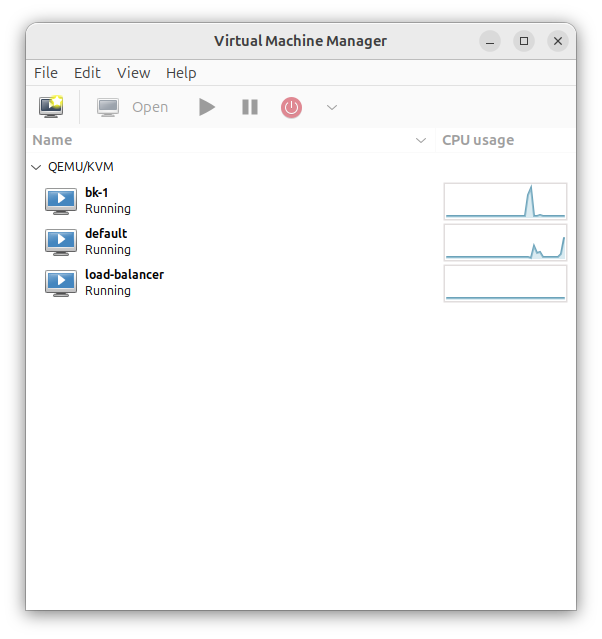

\tableofcontents

# Testowanie ryzyka

## 1. Awaria maszyny z serwisem bezstanowym

Menadżer przez cały czas monitoruje stan serwisów bezstanowych poprzez połączenia typu *heartbeat*. Serwis co jakiś czas przesyła odpowiedź w formacie:

```json
data: {"status": "OK"}
```

Brak odpowiedzi w określonym czasie powoduje ponowne próby połączenia. Jeśli po kilku próbach nie uda się nawiązać kontaktu, maszyna zostaje usunięta, a w jej miejsce automatycznie uruchamiana jest nowa instancja. Co ważne – nowa maszyna otrzymuje ten sam adres IP, co poprzednia.

W przypadku błędnej odpowiedzi serwisu, Nginx jako *load balancer* automatycznie przekierowuje żądanie do innego działającego serwisu, zgodnie z konfiguracją `proxy_next_upstream`.


### Etapy testu

1. Wymuszenie śmierci maszyny bezstanowej

{ width=50% }

2. Tymczasowy brak maszyny z serwisem bezstanowym

{ width=50% }

3. Obsługa zapytań przez inne serwisy


4. Detekcja awarii i uruchomienie nowej instancji

{ width=50% }

Log z systemu:

```sh
2025-06-03T18:32:21.016+02:00  INFO 21744 --- [    parallel-11] p.e.p.i.m.i.
  VmLifecycleHandlerImpl       : Heart beat retry 0 for 
  Stateless(name=default, address=Address(ip=192.168.10.26, port=8080))
2025-06-03T18:32:21.925+02:00  INFO 21744 --- [     parallel-1] p.e.p.i.m.i.
  VmLifecycleHandlerImpl       : Heart beat retry 1 for 
  Stateless(name=default, address=Address(ip=192.168.10.26, port=8080))
2025-06-03T18:32:23.973+02:00  INFO 21744 --- [     parallel-3] p.e.p.i.m.i.
  VmLifecycleHandlerImpl       : Heart beat retry 2 for 
  Stateless(name=default, address=Address(ip=192.168.10.26, port=8080))
2025-06-03T18:32:27.315+02:00  INFO 21744 --- [     parallel-5] p.e.p.i.m.i.
  VmLifecycleHandlerImpl       : Heart beat retry 3 for 
  Stateless(name=default, address=Address(ip=192.168.10.26, port=8080))
2025-06-03T18:32:27.318+02:00 ERROR 21744 --- [or-http-epoll-6] p.e.p.i.m.i.
  VmLifecycleHandlerImpl       : Retries exhausted or other error occurred

reactor.core.Exceptions$RetryExhaustedException: Retries exhausted: 4/4
```

Po czterech nieudanych próbach *heartbeat*, uruchamiana jest nowa maszyna.

## 2. Awaria maszyny z load balancerem

Mechanizm *heartbeat* działa również w przypadku load balancera. W systemie dostępny jest jeden publiczny adres IP przypisany do menadżera głównego. Jeśli wykryta zostanie awaria maszyny z LB, menadżer przekazuje adres IP kolejnemu w kolejce i wyłącza uszkodzoną instancję.

### Etapy testu

1. Wymuszenie śmierci maszyny z LB

{ width=50% }

2. Tymczasowy brak LB

{ width=50% }

Menadżer wykrywa taką sytuację, informuje pozostałych menadżerów o awarii, a następnie wybierany jest nowy główny load balancer, któremu przypisywany jest publiczny adres IP klastra:

```sh
2025-06-03T18:46:25.042+02:00  INFO 21744 --- [or-http-epoll-5] p.e.p.i.m.i.util.CommandLineExtension    :
> ansible-playbook -i 192.168.10.25, ./playbooks/network.yaml 
  -e current_ip=192.168.10.25 -e new_ip=192.168.10.120

PLAY [Configure network] ************************************

TASK [Gathering Facts] **************************************
ok: [192.168.10.25]

TASK [Configure static ip] **********************************
changed: [192.168.10.25]

RUNNING HANDLER [Restart networking] ************************
changed: [192.168.10.25]

PLAY RECAP **************************************************
192.168.10.25              : ok=3    changed=2    unreachable=0    
  failed=0    skipped=0    rescued=0    ignored=0
```

3. Detekcja awarii i start nowej instancji LB z adresem IP z prywatnej puli menadżera

{ width=50% }

Log z systemu:

```sh
2025-06-03T18:46:02.429+02:00  INFO 18787 --- [or-http-epoll-9] p.e.p.i.m.i.
  VmLifecycleHandlerImpl       : Received heart beat from 
  LoadBalancer(name=load-balancer, address=Address(ip=192.168.10.120, port=8080), 
  workers=[Address(ip=192.168.10.16, port=8080), Address(ip=192.168.10.15, port=8080), 
  Address(ip=192.168.10.26, port=8080), Address(ip=192.168.10.24, port=8080)]): 
  HeartBeat(status=OK)
2025-06-03T18:46:03.129+02:00  INFO 18787 --- [or-http-epoll-6] p.e.p.i.m.i.\
  VmLifecycleHandlerImpl       : Received heart beat from 
  Stateless(name=default, address=Address(ip=192.168.10.16, port=8080)): HeartBeat(status=OK)
...
2025-06-03T18:46:07.987+02:00  INFO 18787 --- [     parallel-3] p.e.p.i.m.i.
  VmLifecycleHandlerImpl       : Heart beat retry 1 for 
  LoadBalancer(name=load-balancer, address=Address(ip=192.168.10.120, port=8080), 
  workers=[Address(ip=192.168.10.16, port=8080), Address(ip=192.168.10.15, port=8080), 
  Address(ip=192.168.10.26, port=8080), Address(ip=192.168.10.24, port=8080)])
...
2025-06-03T18:46:18.153+02:00  INFO 18787 --- [     parallel-9] p.e.p.i.m.i.
  VmLifecycleHandlerImpl       : Heart beat retry 3 for 
  LoadBalancer(name=load-balancer, address=Address(ip=192.168.10.120, port=8080), 
  workers=[Address(ip=192.168.10.16, port=8080), Address(ip=192.168.10.15, port=8080), 
  Address(ip=192.168.10.26, port=8080), Address(ip=192.168.10.24, port=8080)])
...
2025-06-03T18:46:20.154+02:00 ERROR 18787 --- [     parallel-7] p.e.p.i.m.i.
  VmLifecycleHandlerImpl       : Retries exhausted or other error occurred

reactor.core.Exceptions$RetryExhaustedException: Retries exhausted: 4/4
```

System cyklicznie wysyła zapytania heartbeat do maszyny z load balancerem. Po czterech nieudanych próbach nawiązania połączenia, instancja zostaje uznana za niedostępną, a jej proces zostaje zakończony. W jej miejsce automatycznie uruchamiana jest nowa maszyna z load balancerem, tym razem oznaczona jako *secondary*. Proces ten gwarantuje zachowanie ciągłości działania klastra oraz natychmiastowe przywrócenie dostępu do usług publicznych.


## 3. Kolizja adresów IP

Każdy menadżer ma przypisaną własną, unikalną pulę adresów IP. Dzięki temu nie dochodzi do kolizji między zarządzanymi przez nich maszynami.

### Konfiguracja menadżera 1:

```yml
application:
  manager-address: http://192.168.10.1:8080
  managers:
    - http://192.168.10.2:8080
  public-address: http://192.168.10.120:8080
  master: true
  available-addresses:
    - http://192.168.10.10:8080
    - http://192.168.10.11:8080
    - http://192.168.10.12:8080
    - http://192.168.10.13:8080
    - http://192.168.10.14:8080
    - http://192.168.10.15:8080
    - http://192.168.10.16:8080
```

### Konfiguracja menadżera 2:

```yml
application:
  manager-address: http://192.168.10.2:8080
  managers:
    - http://192.168.10.1:8080
  public-address: http://192.168.10.120:8080
  master: false
  available-addresses:
    - http://192.168.10.20:8080
    - http://192.168.10.21:8080
    - http://192.168.10.22:8080
    - http://192.168.10.23:8080
    - http://192.168.10.24:8080
    - http://192.168.10.25:8080
    - http://192.168.10.26:8080
```

Adresowanie IP jest statyczne, w ramach jednej podsieci.

## 4. Awaria maszyny z menadżerem

W przypadku awarii menadżera – nie przewidziano automatycznego odzyskiwania. W scenariuszach krytycznych zakłada się ręczną interwencję administratora, co wynika z charakteru projektu (akademicki proof-of-concept).


# Test niezawodności

Poniższy skrypt w Bashu realizuje ciągłe zapytania do serwisu, co 0.5 sekundy:

```bash
#!/bin/bash
while true
do
    curl http://192.168.10.120/random/number --connect-timeout 1 --max-time 2 || true
    echo ""
    sleep 0.5
done
```

Przykładowy wynik działania:

```sh
{"value":69}
{"value":24}
{"value":82}
curl: (28) Operation timed out after 2001 milliseconds with 0 bytes received
{"value":45}
{"value":51}
{"value":54}
```
Przygotowaliśmy prosty skrypt testowy, który co pół sekundy wysyła żądanie do naszego serwisu. W trakcie jego działania celowo wyłączamy najpierw maszynę bezstanową, a następnie maszynę z load balancerem. W obu przypadkach obserwujemy krótką przerwę w dostępności usługi, jednak system bardzo szybko odzyskuje pełną funkcjonalność dzięki mechanizmom wykrywania awarii i automatycznego przywracania instancji. Co istotne, po usunięciu flag `--connect-timeout` oraz `--max-time` z komendy `curl`, przerwa w działaniu serwisu staje się niezauważalna z punktu widzenia użytkownika końcowego — dłuższy czas oczekiwania na odpowiedź maskuje chwilową niedostępność usługi.


# Narzędzia i środowisko

## Sprzęt:

* Dwa laptopy z systemem Ubuntu, połączone przewodem Ethernet.

## Narzędzia:

* **Wirtualizacja:** KVM
* **Obraz systemu:** Alpine Linux – wersja Virtual
* **Serwisy:** Aplikacje Spring napisane w Kotlinie
* **Konfiguracja maszyn:** Ansible
* **Skrypty testowe:** Bash

# Konfiguracja

## Automatyzacja – Skalowalność i Wysoka Dostępność

### Konfiguracja serwisu bezstanowego (stateless)

#### 1. Weryfikacja statusu maszyny wirtualnej

Użyj agenta QEMU:

```bash
virsh qemu-agent-command default '{"execute":"guest-ping"}'
# Oczekiwany wynik: {"return":{}}
```


#### 2. Sprawdzenie aktualnego adresu IP

```shell
$ virsh domifaddr default --source agent
 Name       MAC address          Protocol     Address
-------------------------------------------------------------------------------
 lo         00:00:00:00:00:00    ipv4         127.0.0.1/8
 -          -                    ipv6         ::1/128
 eth0       52:54:00:40:ec:c3    ipv4         192.168.122.231/24
 -          -                    ipv6         fe80::5054:ff:fe40:ecc3/64
```


#### 3. Nadanie statycznego adresu IP przez Ansible

**Playbook Ansible: `playbooks/network.yaml`**

```yaml
- name: Configure network
  hosts: "{{ current_ip }}"
  become: yes
  vars:
    interface: eth0
    ansible_become: false
    ansible_user: root
    ansible_ssh_pass: root

  tasks:
    - name: Configure static ip
      template:
        src: config/interfaces.j2
        dest: /etc/network/interfaces
      notify: Restart networking

  handlers:
    - name: Restart networking
      command: /etc/init.d/networking restart
      async: 1
      poll: 0
```

**Szablon `interfaces.j2`:**

```ini
auto lo
iface lo inet loopback

auto eth0
iface eth0 inet static
    address {{ new_ip }}
    netmask 255.255.255.0
    gateway 192.168.122.1
```

**Uruchomienie playbooka:**

```shell
$ ansible-playbook -i 192.168.122.231, ./playbooks/network.yaml 
  -e current_ip=192.168.122.231 -e new_ip=192.168.122.13

PLAY [Configure network] *******************************************************

TASK [Gathering Facts] *********************************************************
ok: [192.168.122.231]

TASK [Configure static ip] *****************************************************
changed: [192.168.122.231]

RUNNING HANDLER [Restart networking] *******************************************
changed: [192.168.122.231]

PLAY RECAP *********************************************************************
192.168.122.231            : ok=3    changed=2    unreachable=0    
  failed=0    skipped=0    rescued=0    ignored=0
```

#### 4. Weryfikacja dostępności maszyny po zmianie IP

```shell
$ ping -c 1 192.168.122.13
PING 192.168.122.13 (192.168.122.13) 56(84) bytes of data.
64 bytes from 192.168.122.13: icmp_seq=1 ttl=64 time=1021 ms

--- 192.168.122.13 ping statistics ---
1 packets transmitted, 1 received, 0% packet loss, time 0ms
rtt min/avg/max/mdev = 1020.793/1020.793/1020.793/0.000 ms
```


#### 5. Uruchomienie serwisu Java jako daemon

**Playbook Ansible: `playbooks/stateless.yaml`**

```yaml
- name: Configure stateless service
  hosts: "{{ ip }}"
  become: yes
  vars:
    interface: eth0
    ansible_become: false
    ansible_user: root
    ansible_ssh_pass: root

  tasks:
    - name: Start stateless daemon
      ansible.builtin.shell: |
        nohup java -Dserver.forward-headers-strategy=framework 
          -jar /stateless.jar --server.port={{ port }} > stateless.log 2>&1 &
      async: 1
      poll: 0
```

**Uruchomienie:**

```shell
$ ansible-playbook -i 192.168.122.13, ./playbooks/stateless.yaml -e ip=192.168.122.13 -e port=8080

PLAY [Configure stateless service] *********************************************

TASK [Gathering Facts] *********************************************************
ok: [192.168.122.13]

TASK [Start stateless daemon] **************************************************
changed: [192.168.122.13]

PLAY RECAP *********************************************************************
192.168.122.13             : ok=2    changed=1    unreachable=0    
  failed=0    skipped=0    rescued=0    ignored=0
```


## Load Balancer – Konfiguracja i Automatyzacja

### Punkty 1–4

Są identyczne jak w konfiguracji serwisu bezstanowego (ping VM, przypisanie IP przez Ansible, weryfikacja połączenia).


### 5. Uruchomienie serwisu heartbeat na porcie 8080

**Playbook Ansible: `playbooks/heart_beat.yaml`**

```yaml
- name: Configure heartbeat service
  hosts: "{{ ip }}"
  become: yes
  vars:
    interface: eth0
    ansible_become: false
    ansible_user: root
    ansible_ssh_pass: root

  tasks:
    - name: Start heartbeat daemon
      ansible.builtin.shell: |
        nohup java -Dserver.forward-headers-strategy=framework 
          -jar /heartbeat.jar --server.port={{ port }} > heartbeat.log 2>&1 &
      async: 1
      poll: 0
```

**Uruchomienie:**

```shell
$ ansible-playbook -i 192.168.122.12, ./playbooks/heart_beat.yaml -e ip=192.168.122.12 -e port=8080

PLAY [Configure heartbeat service] *********************************************

TASK [Gathering Facts] *********************************************************
ok: [192.168.122.12]

TASK [Start heartbeat daemon] **************************************************
changed: [192.168.122.12]

PLAY RECAP *********************************************************************
192.168.122.12             : ok=2    changed=1    unreachable=0   
 failed=0    skipped=0    rescued=0    ignored=0
```

### 6. Uruchomienie load balancera (NGINX) na porcie 80

**Playbook Ansible: `playbooks/load_balancer.yaml`**

```yaml
- name: Configure load balancer service
  hosts: "{{ ip }}"
  become: yes
  vars:
    interface: eth0
    ansible_become: false
    ansible_user: root
    ansible_ssh_pass: root

  tasks:
    - name: Copy nginx.conf to the server
      copy:
        src: config/nginx.conf
        dest: /etc/nginx/nginx.conf
        backup: yes

    - name: Reload Nginx
      service:
        name: nginx
        state: reloaded
```

**Uruchomienie:**

```shell
$ ansible-playbook -i 192.168.122.12, ./playbooks/load_balancer.yaml -e ip=192.168.122.12

PLAY [Configure load balancer service] *****************************************

TASK [Gathering Facts] *********************************************************
ok: [192.168.122.12]

TASK [Copy nginx.conf to the server] *******************************************
changed: [192.168.122.12]

TASK [Reload Nginx] ************************************************************
changed: [192.168.122.12]

PLAY RECAP *********************************************************************
192.168.122.12             : ok=3    changed=2    unreachable=0    
  failed=0    skipped=0    rescued=0    ignored=0
```

\newpage

## Dostępność i punkty końcowe

### Swagger – Menadżer

**Zarządzanie serwerami**:


\newpage

### Swagger – Stateless Service

**Serwisy aplikacyjne**:


\newpage

### Swagger – Load Balancer

**Koordynacja i routowanie ruchu HTTP**:


## KVM

Poniższe instrukcje przedstawiają proces instalacji oraz podstawowej konfiguracji KVM (Kernel-based Virtual Machine) na systemie Linux, wraz z narzędziem `virt-manager`, które umożliwia graficzne zarządzanie maszynami wirtualnymi.

### 1. Sprawdzenie wsparcia sprzętowego dla wirtualizacji

Aby skorzystać z KVM, procesor musi wspierać technologię wirtualizacji sprzętowej — Intel VT-x (oznaczony jako `vmx`) lub AMD-V (`svm`). Poniższe polecenie sprawdza, ile rdzeni procesora obsługuje te funkcje:

```sh
egrep -c '(vmx|svm)' /proc/cpuinfo
```

Jeśli wynik jest większy niż 0, oznacza to, że system wspiera wirtualizację sprzętową, co jest warunkiem koniecznym do uruchamiania maszyn wirtualnych z akceleracją sprzętową.

### 2. Instalacja wymaganych pakietów

Instalujemy podstawowe składniki środowiska wirtualizacji KVM oraz narzędzia niezbędne do zarządzania maszynami:

```sh
sudo apt update
sudo apt install qemu-kvm libvirt-daemon-system libvirt-clients bridge-utils -y
```

* `qemu-kvm` – odpowiada za uruchamianie maszyn wirtualnych z wykorzystaniem KVM
* `libvirt-daemon-system` oraz `libvirt-clients` – zapewniają usługę `libvirtd` oraz narzędzia do zarządzania maszynami (np. `virsh`)
* `bridge-utils` – umożliwia tworzenie i konfigurowanie mostów sieciowych, co pozwala na lepszą integrację maszyn wirtualnych z siecią fizyczną

### 3. Weryfikacja wsparcia sprzętowego KVM

Sprawdzamy, czy system operacyjny i sprzęt prawidłowo obsługują akcelerację KVM:

```sh
sudo kvm-ok
```

Jeśli wszystko jest skonfigurowane poprawnie, polecenie powinno zwrócić informację, że "KVM acceleration can be used", co oznacza, że maszyny wirtualne będą mogły korzystać z natywnej wydajności procesora.

### 4. Dodanie użytkownika do grup systemowych

Aby umożliwić bieżącemu użytkownikowi zarządzanie maszynami wirtualnymi bez konieczności używania `sudo`, należy dodać go do odpowiednich grup systemowych:

```sh
sudo adduser "$USER" libvirt
sudo adduser "$USER" kvm
```

Po dodaniu użytkownika do grup, konieczne jest ponowne zalogowanie się (lub restart sesji), aby nowe uprawnienia zaczęły obowiązywać.

### 5. Sprawdzenie statusu usługi `libvirtd`

Usługa `libvirtd` musi być uruchomiona, aby możliwe było tworzenie i zarządzanie maszynami wirtualnymi. Jej status można sprawdzić za pomocą:

```sh
sudo systemctl status libvirtd
```

Wynik powinien wskazywać, że usługa działa poprawnie (status `active`).

### 6. Zarządzanie usługą `libvirtd`

W razie potrzeby można ręcznie uruchomić, włączyć przy starcie systemu lub wyłączyć usługę `libvirtd`, korzystając z poniższych poleceń:

```sh
sudo systemctl enable --now libvirtd
sudo systemctl disable --now libvirtd
```

Pierwsze polecenie uruchamia usługę i ustawia ją do automatycznego uruchamiania przy starcie systemu, natomiast drugie wyłącza ją i usuwa z autostartu.

### 7. Instalacja interfejsu graficznego

Instalujemy `virt-manager`, czyli narzędzie graficzne umożliwiające wygodne zarządzanie maszynami wirtualnymi, m.in. tworzenie, konfigurowanie, uruchamianie i monitorowanie:

```sh
sudo apt install virt-manager
```

### 8. Uruchomienie `virt-manager`

Po zainstalowaniu, `virt-manager` można uruchomić za pomocą:

```sh
virt-manager
```

Spowoduje to otwarcie graficznego interfejsu użytkownika, gdzie można zarządzać lokalnymi lub zdalnymi instancjami KVM.

### 9. Instalacja bibliotek pomocniczych libvirt

Dla potrzeb kompilacji lub rozwoju aplikacji korzystających z libvirt (np. przy pisaniu własnych narzędzi lub interfejsów), warto zainstalować pakiet nagłówków i plików deweloperskich:

```sh
sudo apt-get install libvirt-dev
```

Biblioteka ta umożliwia tworzenie aplikacji w językach takich jak C/C++ przy użyciu interfejsu libvirt API.

## Konfiguracja Alpine Linux z usługami Java i SSH oraz uruchomieniem aplikacji z load balancerem

Poniższa dokumentacja przedstawia proces instalacji oraz konfiguracji lekkiego systemu operacyjnego Alpine Linux w środowisku wirtualnym. Celem konfiguracji jest uruchomienie aplikacji Java jako usługi działającej w tle, zapewnienie zdalnego dostępu przez SSH oraz wdrożenie serwera Nginx w roli load balancera.

### 1. Pobranie i instalacja Alpine Linux

Pobierz najnowszy obraz Alpine Linux w wersji „Virtual”, dostosowany do uruchamiania w środowiskach wirtualnych, z oficjalnej strony:

[Alpine Linux](https://alpinelinux.org/downloads/)

**Domyślne dane dostępowe:**

* **Login:** `root`
* **Hasło:** brak (pozostaw puste przy pierwszym logowaniu)

### 2. Podstawowa konfiguracja systemu

Po uruchomieniu Alpine Linux, wykonaj interaktywną konfigurację systemu:

```shell
setup-alpine -q
```

Wybierz odpowiedni układ klawiatury:

```shell
Select keyboard layout: pl
Select variant: pl
```

Następnie zainstaluj system na wybranym dysku (w tym przypadku `/dev/vda`), używając trybu instalacji systemowej:

```shell
setup-disk -m sys /dev/vda
```

Po potwierdzeniu usunięcia danych dysku:

```shell
WARNING: Erase the above disk(s) and continue (y/n) [n]: y
```

Zakończ instalację wyłączając maszynę:

```shell
poweroff
```

### 3. Konfiguracja po restarcie

Po ponownym uruchomieniu systemu, ustaw hasło dla konta `root`:

```shell
passwd root
```

Wprowadź nowe hasło dwukrotnie:

```shell
New password: root
Retype password: root
```

Zainstaluj edytor tekstu, np. `nano`, dla wygody konfiguracji:

```shell
apk add nano
```

### 4. Konfiguracja repozytoriów pakietów

Edytuj plik zawierający listę źródeł pakietów:

```shell
nano /etc/apk/repositories
```

Usuń znak komentarza z repozytorium `community`, aby umożliwić dostęp do szerszego zestawu pakietów:

Z:

```shell
#/media/cdrom/apks
http://dl-cdn.alpinelinux.org/alpine/v3.21/main
#http://dl-cdn.alpinelinux.org/alpine/v3.21/community
```

Na:

```shell
#/media/cdrom/apks
http://dl-cdn.alpinelinux.org/alpine/v3.21/main
http://dl-cdn.alpinelinux.org/alpine/v3.21/community
```

Zapisz i zamknij plik, a następnie zaktualizuj indeks dostępnych pakietów:

```shell
apk update
```

### 5. Instalacja środowiska Java

Zainstaluj środowisko uruchomieniowe OpenJDK w wersji 21:

```shell
apk add openjdk21
```


### 6. Konfiguracja serwera SSH

Dodaj pakiet `openssh-server` i wykonaj podstawową konfigurację:

```shell
apk add openssh-server
cp /etc/ssh/sshd_config /etc/ssh/ssh_config.backup
```

Wygeneruj domyślne klucze hosta:

```shell
ssh-keygen -A
```

Parametr `-A` powoduje wygenerowanie wszystkich domyślnych typów kluczy, jeśli jeszcze nie istnieją, co jest wymagane do działania serwera SSH.


#### Modyfikacja konfiguracji SSH

Zmień ustawienia logowania root, aby umożliwić dostęp:

```shell
nano /etc/ssh/ssh_config
```

Zamień (odkomentuj i zmodyfikuj):

```shell
#PermitRootLogging prohibit-password
```

na:

```shell
PermitRootLogging yes
```

Sprawdź poprawność konfiguracji serwera SSH:

```shell
sshd -t -f /etc/ssh/sshd_config
```

**Parametry:**

- `-t` – test trybu konfiguracji
- `-f` – wskazanie konkretnego pliku konfiguracyjnego

Uruchom usługę i dodaj ją do autostartu:

```shell
service sshd restart
rc-update add sshd default
rc-service sshd start
```

### 7. Połączenie z maszyną zdalnie

Z innego komputera można teraz nawiązać połączenie z serwerem Alpine za pomocą SSH:

```shell
$ ssh root@192.168.122.26
The authenticity of host '192.168.122.26 (192.168.122.26)' can't be established.
ED25519 key fingerprint is SHA256:EMjnkHpSoKWgiz6S6fBAgR4aaKjGxC79sG/oSBUb0oA.
This key is not known by any other names.
Are you sure you want to continue connecting (yes/no/[fingerprint])? yes
Warning: Permanently added '192.168.122.26' (ED25519) to the list of known hosts.
root@192.168.122.26's password:
Welcome to Alpine!

The Alpine Wiki contains a large amount of how-to guides and general
information about administrating Alpine systems.
See <https://wiki.alpinelinux.org/>.

You can setup the system with the command: setup-alpine

You may change this message by editing /etc/motd.

alpine:~#
```

Po akceptacji klucza hosta i podaniu hasła, użytkownik zostaje zalogowany do systemu. Pojawia się domyślny komunikat powitalny Alpine Linux.


### 8. Uruchomienie aplikacji Java

Prześlij plik JAR z aplikacją na serwer Alpine za pomocą `scp`:

```shell
scp ./stateless/build/libs/stateless.jar root@192.168.122.26:/stateless.jar
```

Uruchom aplikację:

```shell
java -jar /stateless.jar
```

Dostęp testowy do endpointu REST aplikacji:

```
GET http://192.168.122.26:8080/random/boolean?probability=1.0
```

Aby aplikacja działała w tle (nawet po wylogowaniu):

```shell
nohup java -jar /stateless.jar > stateless.log 2>&1 &
```

Sprawdzenie działania aplikacji:

```shell
ps aux | grep stateless.jar
```


### 9. Instalacja i konfiguracja serwera Nginx

Zainstaluj serwer Nginx jako lekki i wydajny serwer HTTP:

```shell
apk add nginx
```

Dodaj go do usług uruchamianych automatycznie i uruchom:

```shell
rc-update add nginx default
rc-service nginx start
```

Sprawdź status oraz działanie:

```shell
rc-service nginx status
curl http://localhost
curl http://192.168.122.26
```


#### Modyfikacja konfiguracji Nginx

Wprowadź zmiany w pliku konfiguracyjnym:

```shell
nano /etc/nginx/nginx.conf
```

Po modyfikacjach zrestartuj serwer:

```shell
rc-service nginx reload
```


### 10. Instalacja i konfiguracja QEMU Guest Agent

Agent QEMU umożliwia integrację maszyny wirtualnej z hypervisorem, m.in. przekazywanie sygnałów systemowych, synchronizację czasu i bezpieczne wyłączanie systemu:

```shell
apk add qemu-guest-agent
rc-update add qemu-guest-agent default
rc-service qemu-guest-agent start
```

Sprawdzenie statusu:

```shell
rc-service qemu-guest-agent status
```


### 11. Instalacja Pythona (wymagany przez Ansible)

```shell
apk add python3
```

### 12. Konfiguracja statycznego adresu IP

Domyślnie Alpine uzyskuje adres IP dynamicznie przez DHCP. W celu zapewnienia stałego adresu w klastrze, edytujemy plik konfiguracyjny sieci:

Dla maszyny aplikacyjnej (stateless):

```sh
auto lo
iface lo inet loopback

auto eth0
iface eth0 inet static
    address 192.168.10.200
    netmask 255.255.255.0
    gateway 192.168.10.1
```

Dla load balancera:

```sh
auto lo
iface lo inet loopback

auto eth0
iface eth0 inet static
    address 192.168.10.201
    netmask 255.255.255.0
    gateway 192.168.10.1
```

Zastosowanie zmian w konfiguracji sieci:

```sh
/etc/init.d/networking restart
```

## Konfiguracja wirtualnego przełącznika (bridge)

Wirtualny przełącznik (ang. *bridge*) umożliwia łączenie różnych interfejsów sieciowych w jedną wspólną przestrzeń L2, co jest szczególnie przydatne przy tworzeniu środowisk klastrowych i maszyn wirtualnych.


### Konfiguracja Netplanu – Serwer 1

Plik konfiguracyjny `/etc/netplan/wso.yaml` powinien zawierać następującą definicję:

```yaml
network:
  version: 2
  ethernets:
    eno2: {}
  bridges:
    br0:
      interfaces: [eno2]
      dhcp4: no
      addresses: [192.168.10.1/24]
```


### Konfiguracja Netplanu – Serwer 2

W przypadku drugiego serwera, gdzie interfejs ma nazwę `enx000ec6b01bc1`:

```yaml
network:
  version: 2
  ethernets:
    enx000ec6b01bc1: {}
  bridges:
    br0:
      interfaces: [enx000ec6b01bc1]
      dhcp4: no
      addresses: [192.168.10.2/24]
```


### Zastosowanie konfiguracji

Po zapisaniu zmian zastosuj konfigurację Netplanu:

```shell
sudo netplan apply
```


### Weryfikacja działania bridge’a

Aby sprawdzić poprawność działania mostka sieciowego oraz jego powiązanie z interfejsem fizycznym, użyj następujących poleceń:

**Lista mostków sieciowych:**

```shell
brctl show
```

**Weryfikacja, czy interfejs został przypisany do bridge’a:**

```shell
bridge link show
```

### Ręczne przypisanie interfejsu do bridge’a

Jeśli interfejs fizyczny nie został automatycznie dołączony do bridge’a, można to zrobić ręcznie:

```shell
sudo ip link set eno2 down
sudo ip link set eno2 master br0
sudo ip link set eno2 up
```


### Reset konfiguracji IP interfejsu fizycznego

Po ręcznym przypisaniu interfejsu do mostka, należy wyczyścić jego adres IP:

```shell
sudo ip addr flush dev eno2
```

## Lokalna konfiguracja i uruchomienie menadżera

Aplikacja wspiera dwa profile środowiskowe:

* `bk` – Bartłomiej Krawczyk
* `mb` – Mateusz Brzozowski


### 1. Instalacja środowiska SDK

Na podstawie pliku `.sdkmanrc` zainstaluj wymagane komponenty:

```bash
sdk env install
```


### 2. Budowanie pliku JAR aplikacji

```bash
./gradlew manager:bootJar
```


### 3. Instalacja pakietów systemowych

Wymagane narzędzia:

```bash
sudo apt install ansible sshpass
```


### 4. Uruchomienie aplikacji z określonym profilem

Uruchomienie aplikacji z wybranym profilem środowiskowym:

#### Profil `bk`:

```bash
SPRING_PROFILES_ACTIVE=bk java -jar ./manager/build/libs/manager.jar
```

#### Profil `mb`:

```bash
SPRING_PROFILES_ACTIVE=mb java -jar ./manager/build/libs/manager.jar
```